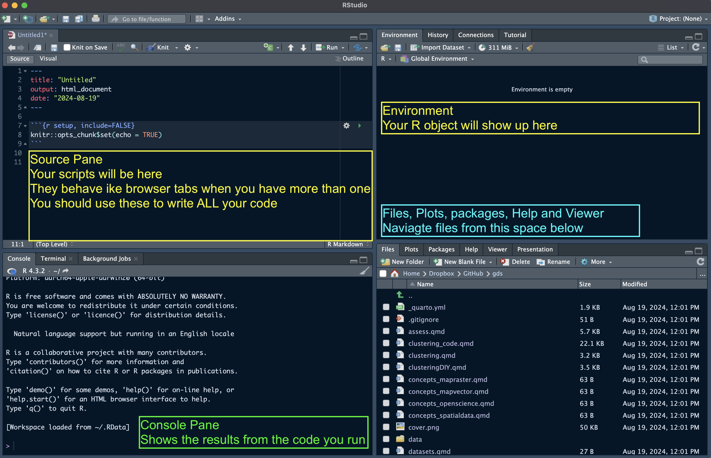
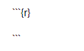
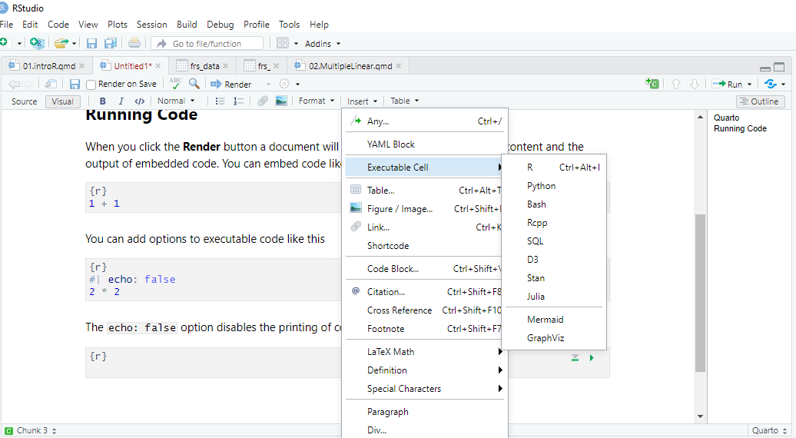
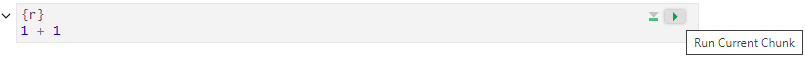

*The following material has been readapted from*:

-   https://dereksonderegger.github.io/570L/1-introduction.html by Derek L. Sonderegger;

**Open this lab in RStudio: in the Files pane, click `labs` and then `00.introR.qmd`. Save your own copy in `myLabs` (`File -> Save As...`) and work on the copy. Work through it from top to bottom, running each code chunk.** (First time? Follow the [Setup](../general/setup.qmd) guide first.)

This short lab shows you how to find your way around RStudio and how to run R code. It takes about 20 minutes. Then move on to [Lab: Exploring a Dataset](01.DataExploration.qmd), the main practical for Week 1.

## R and RStudio

**R** is a free program for statistics and data analysis. You use it by writing code, not by clicking menus. This takes a little getting used to, but it has a big advantage: your code is an exact record of every step of your analysis, so you (or anyone else) can run it again and get the same result.

**RStudio** is the program you use to write and run R code. In this module it runs in your browser, and R and all the packages you need are already installed.

### The four panels

RStudio looks something like this:

```{r class.source = "fold-show", echo = F}

```

-   **Top left, Source:** the file you are working on, for example this lab.
-   **Bottom left, Console:** where R runs code and prints the results. You can also type code here directly and press Enter. Ignore the **Terminal** tab next to it: you don't need it.
-   **Top right, Environment:** the data and variables you have created so far.
-   **Bottom right, Files / Plots / Packages / Help:** your course folder, your charts, and help pages.

You can change the colours and font size in `Tools -> Global Options -> Appearance`.

## Quarto documents and code chunks

The labs are **Quarto documents** (`.qmd` files). A Quarto document mixes normal text, like this paragraph, with **code chunks**: the grey boxes that contain R code. You will write your assessment report in the same kind of file.

A code chunk starts with ```` ```{r} ```` and ends with ```` ``` ````:

```{r class.source = "fold-show", echo = F}

```

The buttons **Source** and **Visual** at the top left of the file switch between two views of the same file. In the **Visual** view you can also insert a chunk from `Insert -> Executable Cell -> R`:

```{r class.source = "fold-show", echo = F}

```

To run a chunk, click the green arrow in its top-right corner. The result appears under the chunk.

```{r class.source = "fold-show", echo = F}

```

::: {style="background-color: #FFFBCC; padding: 10px; border-radius: 5px; border: 1px solid #E1C948;"}
**Task**: Run the chunk below.
:::

```{r}
print("hello world")
```

Some useful shortcuts (use Cmd instead of Ctrl on a Mac):

| Shortcut | What it does |
|------------------|------------------------------------------------|
| Ctrl+Enter | Run the line where your cursor is |
| Ctrl+Shift+Enter | Run the whole chunk |
| Ctrl+Alt+I | Insert a new chunk (or use `Code -> Insert Chunk`) |
| Ctrl+S | Save the file |

To add your own notes, just type in the white space between chunks. To try out your own code, insert a new chunk.

## R as a calculator

::: {style="background-color: #FFFBCC; padding: 10px; border-radius: 5px; border: 1px solid #E1C948;"}
**Task**: Run each chunk in this section and check that you understand the result.
:::

```{r}
# Some simple addition. Text after a # is a comment: R ignores it.
2+3
```

```{r}
6*8
4^3
exp(1)   # exp() is the exponential function
```

R has most constants and mathematical functions you could want. For example, `abs()` gives the absolute value of a number, and `round()` rounds it to the nearest whole number.

```{r}
pi     # the constant 3.14159265...
abs(-1.77)
round(1.77)
```

### Functions and arguments

`abs()` and `round()` are **functions**. The values you give a function inside the brackets are its **arguments**, separated by commas. Some arguments are required and some are optional.

The `log()` function calculates a logarithm. It takes the number `x` and the `base`. If you name the arguments, the order doesn't matter:

```{r}
log(x=5, base=10)
log(base=10, x=5)
```

If you don't name them, R assumes that the first value is `x` and the second is `base`:

```{r}
log(5, 10)
log(10, 5)
```

### Getting help

To see what a function does and which arguments it takes, type `?` followed by its name in the console, for example `?log`. The help page opens in the **Help** tab, bottom right.

## Variables

To use a result later, save it in a **variable**. R uses the arrow `<-` for this (`=` also works, but pick one and stick with it).

```{r}
var <- 2*7.5       # create two variables
another_var <- 5   # notice they appear in the Environment panel
var
var * another_var
```

**Variable names cannot start with a number or contain spaces, and they are case sensitive:** `var` and `Var` are two different variables.

## Packages

Packages add extra functions to R. For example, `dplyr` has functions for working with data and `ggplot2` makes charts. **All the packages you need in this module are already installed in your codespace.** You just need to load a package with `library()` before you use it, once per session:

```{r, warning=FALSE, message=FALSE}
library(dplyr)   # load the dplyr package; we will use it in the next lab
```

::: callout-note
If you use RStudio on a university PC or your own laptop instead of the codespace, a package may be missing. You will see an error like `there is no package called 'dplyr'`. Install the package once with `Tools -> Install Packages...`, then run `library()` again.
:::

## Next

That's all you need to start. Save this file (Ctrl+S), then open `01.DataExploration.qmd` in the `labs` folder and save your copy in `myLabs`: [Lab: Exploring a Dataset](01.DataExploration.qmd).
