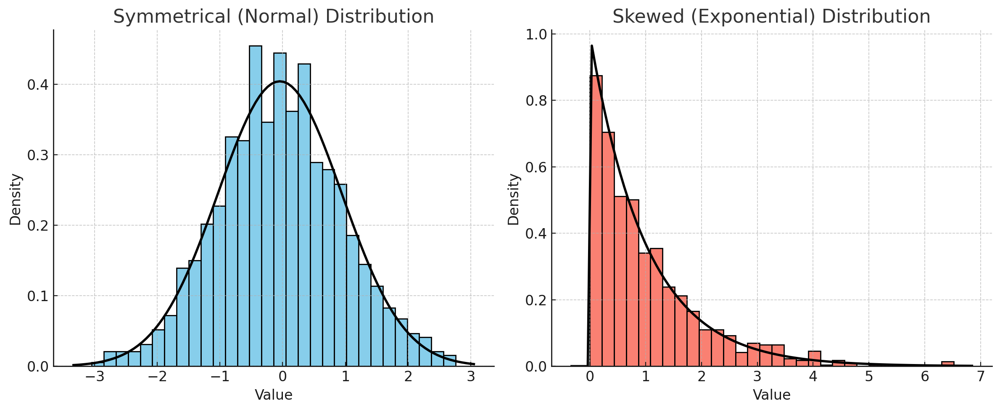

**IMPORTANT: Before starting: verify that you have set the directory correctly and familiarise yourself with working with directories and loading files. These are the [instructions](https://gdsl-ul.github.io/stats/general/wdPaths.html)**.

**Now create a .qmd project. We use the `File -> New File -> Quarto Document..` dropdown option; a menu will appear asking you for the document title, author, and preferred output type. You can select HTML. Call it "*week2*" and save it in your main folder.**

Follow the practical below. You can describe what you are doing in normal text. See [here](https://quarto.org/docs/authoring/markdown-basics.html) for how to format normal text in Markdown documents.

In this week’s practical, we will review how to calculate and visualise correlation coefficients between variables. This practical is split into four parts. The first focuses on measuring and visualising the relationship between **continuous variables**. The second goes through the implementation of a Linear Regression Model, again between continuous variables. The third checks whether the fitted model can be trusted, and the fourth is for practice.

Before getting into it, have a look at this [resource](https://mlu-explain.github.io/linear-regression/), it really helps understand how regression models work.

The lecture's slides can be found [here](https://github.com/GDSL-UL/stats/blob/main/lectures/lecture02.pdf).

Before completing the practical, please take this [quiz](https://canvas.liverpool.ac.uk/courses/84668/quizzes/169285?module_item_id=2435564).

**Learning Objectives:**

-   Visualise the association between two continuous variables using a scatterplot.
-   Measure the strength of the association between two variables by calculating their correlation coefficient.
-   Build a formal regression model.
-   Understand how to estimate and interpret a multiple linear regression model.
-   Check whether a fitted model is trustworthy, using diagnostic plots.

*Note on file paths*: When calling the `read.csv` function, the path will vary depending on the location of the script it is being executed or your working directory (WD):

1.  **If the script or your WD is in a sub-folder** (e.g., `labs`), use `"../data/Census2021/EW_DistrictPercentages.csv"`. The `..` tells R to go one level up to the main directory (`stats/`) and then access the `data/` folder. **Example**: `read.csv("../data/Census2021/EW_DistrictPercentages.csv")`.
2.  **If the script is in the main directory** (e.g. inside `stats/`), you can access the data directly using `"data/Census2021/EW_DistrictPercentages.csv"`. Here, no `..` is necessary as the `data/` folder is directly accessible from the working directory. **Example**: `read.csv("data/Census2021/EW_DistrictPercentages.csv")`

## Part I. Correlation

### Data Overview: Descriptive Statistics

Let's start by picking **one dataset derived from the English-Wales 2021 Census data**. You can choose one dataset that aggregates data either at a) county, b) district, or c) ward-level. Lower Tier Local Authority-, Region-, and Country-level data is also available in the data folder.

see also: https://canvas.liverpool.ac.uk/courses/93312/pages/census-data?module_item_id=2727713

```{r}
# Load necessary libraries 
library(ggplot2) 
library(dplyr) 

options(scipen = 999, digits = 4)  # Avoid scientific notation and round to 4 decimals globally

# load data - you may need to remove "../"
census <- read.csv("../data/Census2021/EW_DistrictPercentages.csv") # District level
```

We’re using a (district/ward/etc.) level census dataset that includes:

-   \% of population with poor health (variable name: `pct_Very_bad_health`).
-   \% of population with no qualifications (`pct_No_qualifications`).
-   \% of male population (`pct_Males`).
-   \% of population in a higher managerial/professional occupation (`pct_Higher_manager_prof`).

First, let's get some descriptive statistics that help identify general trends and distributions in the data.

```{r}
# Summary statistics
summary_data <- census %>%
  select(pct_Very_bad_health, pct_No_qualifications, pct_Males, pct_Higher_manager_prof) %>%
  summarise_all(list(mean = mean, sd = sd))
summary_data
```

**Q1**. Complete the table below by specifying each variable type (continuous or categorical) and reporting its mean and standard deviation.

| Variable Name | Type (Continuous or Categorical) | Mean | Standard Deviation |
|----|----|----|----|
| pct_Very_bad_health |  |  |  |
| pct_No_qualifications |  |  |  |
| pct_Males |  |  |  |
| pct_Higher_manager_prof |  |  |  |

### Simple visualisation for continuous data

You can visualise the relationship between two continuous variables using a scatter plot. Using the chosen census datasets, visualise the association between the % of population with bad health (`pct_Very_bad_health`) and each of the following:

-   the % of population with no qualifications (`pct_No_qualifications`);
-   the % of population aged 65 to 84 (`pct_Age_65_to_84`);
-   the % of population in a married couple (`pct_Married_opposite_sex_couple`);
-   the % of population in a Higher Managerial or Professional occupation (`pct_Higher_manager_prof`).

```{r}
# 1
ggplot(census, aes(x = pct_No_qualifications, y = pct_Very_bad_health)) +
    geom_point() + 
    labs(title = paste("Scatterplot of % people in Very bad health vs & % people", "No Qualifications"), 
         x = "% no qualifications", y = "% Very bad_health") +
    theme_minimal()

# 2
ggplot(census, aes(x = pct_Age_65_to_84, y = pct_Very_bad_health)) +
    geom_point() + 
    labs(title = paste("Scatterplot of % people in Very bad health vs & % people", "aged between 65 and 84"),
         x = "% aged 65-84", y = "% Very bad_health") +
    theme_minimal()

# 3
ggplot(census, aes(x = pct_Married_opposite_sex_couple, y = pct_Very_bad_health)) +
    geom_point() + 
    labs(title = paste("Scatterplot of % people in Very bad health vs & % people", "in married couples."), 
         x = "% married couples", y = "% Very bad_health") +
    theme_minimal()

# 4
ggplot(census, aes(x = pct_Higher_manager_prof, y = pct_Very_bad_health)) +
    geom_point() + 
    labs(title = paste("Scatterplot of % people in Very bad health vs & % people", "in higher managerial professions."), 
         x = "% higher managerial professions", y = "% Very bad_health") +
    theme_minimal()

```

**Q2. Which of the associations do you think is strongest, which one is the weakest?**

As noted before, an observed association between two variables is no guarantee of causation. It could be that the observed association is:

-   simply a chance one due to sampling uncertainty;
-   caused by some third underlying variable which explains the spatial variation of both of the variables in the scatterplot;
-   due to the inherent arbitrariness of the boundaries used to define the areas being analysed (the ‘Modifiable Area Unit Problem’).

**Q3. Setting these caveats to one side, are the associations observed in the scatter-plots suggestive of any causative mechanisms of bad health?**

Rather than relying upon an impressionistic view of the strength of the association between two variables, we can measure that association by calculating the relevant correlation coefficient. The Table below identifies the statistically appropriate measure of correlation to use between two continuous variables.

| Variable Data Type                     | Measure of Correlation | Range    |
|----------------------------------------|------------------------|----------|
| Both symmetrically distributed         | Pearson’s              | -1 to +1 |
| One or both with a skewed distribution | Spearman’s Rank        | -1 to +1 |

**The difference**: Pearson's measures how well the two variables follow a *straight line*, and assumes both are reasonably symmetrically distributed. Spearman's works on ranks instead, so it copes with skewed variables and with relationships that are consistently increasing or decreasing without being straight.

When calculating correlation for a single pair of variables, select the method that best fits their data distribution:

-   Use **Pearson’s** if both variables are symmetrically distributed.
-   Use **Spearman’s** if one or both variables are skewed.

```{r class.source = "fold-show", echo = F}

```

You can check the distribution of a variable (e.g. `pct_No_qualifications` like this):

```{r}
# Plot histogram with density overlay for a chosen variable (e.g., 'pct_No_qualifications')
ggplot(census, aes(x = pct_No_qualifications)) + 
	geom_histogram(aes(y = after_stat(density)), bins = 30, color = "black", fill = "skyblue", alpha = 0.7) +
	geom_density(color = "darkblue", linewidth = 1) +
	labs(title = "Distribution of pct_No_qualifications", x = "Value", y = 	"Density") +
  theme_minimal()
```

If you are comparing several pairs of variables, use the **same** measure for all of them, because Pearson and Spearman values are not directly comparable in size. Calculating both is a useful check: if the two broadly agree, your conclusion does not depend on which one you picked. In a report you would normally present just one, usually Pearson's.

::: {style="background-color: #FFFBCC; padding: 10px; border-radius: 5px; border: 1px solid #E1C948;"}
**Research Question 1: Which of our selected variables are most strongly correlated with % of population with bad health?**
:::

To answer this question, complete the Table below by editing/running this code:

Pearson correlations

```{r}
pearson_correlation <- cor(census$pct_Very_bad_health,
	census$pct_No_qualifications,use = "complete.obs", method = "pearson")
	
# Display the results
cat("Pearson Correlation:", pearson_correlation, "\n")
```

Spearman correlations:

```{r}
spearman_correlation <- cor(census$pct_Very_bad_health,
	census$pct_No_qualifications, use = "complete.obs", method = "spearman")

cat("Spearman Correlation:", spearman_correlation, "\n")
```

| Covariates                                            | Pearson | Spearman |
|-------------------------------------------------------|---------|----------|
| pct_Very_bad_health - pct_No_qualifications           |         |          |
| pct_Very_bad_health - pct_Age_65_to_84                |         |          |
| pct_Very_bad_health - pct_Married_opposite_sex_couple |         |          |
| pct_Very_bad_health - pct_Higher_manager_prof         |         |          |

**What can you make of these numbers?**

If you think you have found a correlation between two variables in our dataset, this doesn’t mean that the same association holds in general. As we saw last week, an association measured on a sample might not hold in the wider population, simply because of who happened to be sampled. (The Census data used here covers every district rather than a sample, so read the test below as asking whether a pattern this strong is likely to have arisen by chance.)

For this reason, we need to verify whether the correlation is statistically significant,

```{r}
# significance test for pearson, for example
pearson_test <- cor.test(census$pct_Very_bad_health,
	census$pct_No_qualifications, method = "pearson", use = "complete.obs")
pearson_test
```

Look at https://www.rdocumentation.org/packages/stats/versions/3.6.2/topics/cor.test for details about the function. But in general, when calculating the correlation between two variables, a **p-value** accompanies the correlation coefficient to indicate the statistical significance of the observed association. This p-value tests the null hypothesis that there is no association between the two variables (i.e., that the correlation is zero).

As we saw last week, the p-value answers one specific question: *if there were genuinely no association between these two variables in the population, how often would sampling alone produce a correlation at least as strong as the one we observed?* A small p-value means that sampling luck is a poor explanation for what we are seeing, and we reject the null hypothesis.

By convention, a p-value below 0.05 is called statistically significant. Sometimes, in research papers or tables, significance levels are denoted with asterisks: one asterisk (`*`) indicates p \< 0.05, two asterisks (`**`) indicate p \< 0.01, and three asterisks (`***`) indicate p \< 0.001.

Two reminders from last week, because both are easy to get wrong in a report (there is more on all of this in [Samples, Uncertainty and P-values](https://gdsl-ul.github.io/stats/general/inference.html), which is worth reading before you write up):

-   A p-value is **not** the probability that the association is real, and `***` does not mean "99.9% certain there is a relationship". The p-value is calculated *assuming* there is no association, so it cannot tell you how likely that assumption is.
-   A p-value tells you whether an association is **detectable**, not whether it is **large**. With enough observations, a negligible correlation will still come out significant. Always report the size of the correlation alongside its p-value, and interpret the size.
-   A p-value says nothing about **causation**. It cannot tell a real causal relationship apart from a confounded one; that judgement comes from your literature review and research design, never from the output.

## Part II. Implementing a Linear Regression Model

A key goal of data analysis is to explore the potential factors of health at the local district level. So far, we have used cross-tabulations and various bivariate correlation analysis methods to explore the relationships between variables. One key limitation of standard correlation analysis is that it remains hard to look at the associations of an outcome/dependent variable to multiple independent/explanatory variables at the same time. Regression analysis provides a very useful and flexible methodological framework for such a purpose. Therefore, we will investigate how various local factors impact residents' health by building a multiple linear regression model in R.

We use `pct_Very_bad_health` as a proxy for residents' health.

::: {style="background-color: #FFFBCC; padding: 10px; border-radius: 5px; border: 1px solid #E1C948;"}
**Research Question 2: How do local factors affect residents’ health?**
:::

**Dependent (or Response) Variable**:

-   \% of population with bad health (`pct_Very_bad_health`).

**Independent (or Explanatory) Variables**:

-   \% of population with no qualifications (`pct_No_qualifications`).
-   \% of male population (`pct_Males`).
-   \% of population in a higher managerial/professional occupation (`pct_Higher_manager_prof`).

Load some other Libraries

```{r}
library(tidyverse)
library(broom)
```

and the data (if not loaded):

```{r}
# Load dataset
census <- read.csv("../data/Census2021/EW_DistrictPercentages.csv")
```

A regression model estimates how changes in the **dependent** variable $Y$ are associated with changes in the **independent** variables $X_1, X_2, X_3$. It does this by finding the line (or, with several predictors, the flat surface) that comes closest to all the observed points at once — "closest" meaning it makes the gaps between the observed values of $Y$ and the values the model predicts as small as possible. This is why it is called *Ordinary Least Squares* (OLS) regression.

You met **Simple Linear Regression** in class, where one independent variable explains an outcome. Real-world phenomena usually have several causes at once, and multiple linear regression simply extends the same idea to several independent variables together.

Here, regression allows us to examine the relationship between people's health rates and multiple independent variables.

Before starting, we define two hypotheses:

-   **Null hypothesis** ($H_0$): For each variable $X_n$, there is no effect of $X_n$ on $Y$.
-   **Alternative hypothesis** ($H_1$): There is an effect of $X_n$ on $Y$.

We will test if we can reject the null hypothesis.

### Fitting the Model

```{r}
# Linear regression model
model <- lm(pct_Very_bad_health ~ pct_No_qualifications + pct_Males + pct_Higher_manager_prof, data = census)
summary(model)
```

**Code explanation**

-   **`lm()`** stands for "linear model". The formula reads as "very bad health, explained by no qualifications, males and higher managerial/professional": the dependent variable goes on the left of the `~`, and the independent variables on the right, joined by `+`.
-   **`model <-`** stores the fitted model in an object called `model`, so we can ask it questions afterwards.
-   **`summary(model)`** prints the results. It produces a lot at once, so we will take it apart one piece at a time below.

**We can focus only on certain output metrics:**

```{r}
# Regression coefficients
coefficients <- tidy(model)
coefficients
```

These are:

-   **Regression Coefficient Estimates.**
-   **P-values.**
-   **Adjusted R-squared**.

### How to interpret the output metrics

#### **Regression** Coefficient Estimates

The `Estimate` column tells us how $Y$ changes as each independent variable changes.

**Intercept** ($β_0$): the value of $Y$ when every independent variable is zero.

**Slopes** ($β_1$, $β_2$, ...): the average change in $Y$ for a one unit increase in that independent variable, *while the others stay where they are*. Two things to watch:

-   **Know your units.** One "unit" could be a year for an age variable, or one percentage point for a percentage — which is the case for every variable this week.
-   **"Holding the others constant"** is what makes multiple regression worth doing: each coefficient is the effect of that variable over and above whatever the other variables in the model already account for.

So for our model:

-   The association of `pct_No_qualifications` is positive and strong: each increase of 1 percentage point in `pct_No_qualifications` is associated with an increase of 0.05 percentage points in the very bad health rate.
-   The association of `pct_Males` is negative and strong: each increase of 1 percentage point in `pct_Males` is associated with a decrease of 0.07 percentage points in `pct_Very_bad_health` across England and Wales.
-   The association of `pct_Higher_manager_prof` is negative but weak: each increase of 1 percentage point in `pct_Higher_manager_prof` is associated with a decrease of 0.013 percentage points in `pct_Very_bad_health`.

#### P-values and Significance

Each coefficient gets its own p-value, reported in the column `Pr(>|t|)` with the same asterisk conventions as in Part I. It asks the same question we met last week: *if $X_n$ had no effect on $Y$ in the population, how often would chance alone produce a coefficient at least as far from zero as the one we estimated?* Very small p-values mean chance is a poor explanation for the estimated relationship, so we reject $H_0$ for that variable.

In this case, we can say:

-   Given that the p-value is indicated by `***`, changes in `pct_No_qualifications` and `pct_Males` are significantly associated with changes in `pct_Very_bad_health` at the \<0.001 level; the association is highly statistically significant; we can be confident that the observed relationship between these variables and `pct_Very_bad_health` is not due to chance.
-   Given that the p-value is indicated by `**`, changes in `pct_Higher_manager_prof` are significantly associated with changes in `pct_Very_bad_health` at the \<0.01 level. Chance remains an unlikely explanation for this coefficient, though the evidence is weaker than for the other two variables.

In all three cases we can reject the **Null** hypothesis ($H_0$: there is no association between the independent variable and $Y$).

**Remember**, if the *p-value* of a coefficient is smaller than 0.05, that coefficient is conventionally called statistically significant. If the *p-value* is larger than 0.05, you have **no evidence** of an association, which is not at all the same as evidence that there is **no** association. A real relationship can easily fail to reach significance when the sample is small or the data are noisy (there is a worked example of exactly this in [Samples, Uncertainty and P-values](https://gdsl-ul.github.io/stats/general/inference.html)). Phrase this carefully in your report: "no significant association was found" is defensible, "there is no association" is not.

Note also that significance and importance are separate questions. `pct_Higher_manager_prof` is statistically significant, but its coefficient of -0.013 means that a 1 percentage point change in it is associated with a change of roughly one hundredth of a percentage point in very bad health. Report the size of an effect, not just its stars.

#### R-squared and Adjusted R-squared

**R-squared** tells you what share of the variation in $Y$ your independent variables account for. An R-squared of 0.6 means the model explains 60% of the variation in $Y$; the remaining 40% is down to things the model does not contain.

**Adjusted R-squared** does the same job, but penalises you for adding variables. This matters because plain R-squared can only ever go up when you add a predictor, even a useless one, so it is the adjusted version you should compare between models and the adjusted version you should report.

There is no threshold that makes a model "good". What counts as a respectable R-squared depends entirely on what you are modelling: area-level Census data often gives high values because districts are averages of thousands of people, while a model of individual survey responses might explain 10% and still be a perfectly sound piece of work. Do not chase the number, and do not dismiss a model for having a low one — explain what it means in your context.

### Interpreting the Results

```{r}
coefficients
```

**Q4**. Complete the table above by filling in the coefficients, t-values, p-values, and indicating if each variable is statistically significant.

| Variable Name           | Coefficients | t-values | p-values | Significant? |
|-------------------------|--------------|----------|----------|--------------|
| pct_No_qualifications   |              |          |          |              |
| pct_Males               |              |          |          |              |
| pct_Higher_manager_prof |              |          |          |              |

From the lecture notes, you know that the Intercept or Constant represents the estimated average value of the outcome variable when the values of all independent variables are equal to zero.

**Q5**. When values of `pct_Males`, `pct_No_qualifications` and `pct_Higher_manager_prof` are all $zero$, what is the % of population with very bad health? Is the intercept term meaningful? Are there any districts (or zones, depending on the dataset you chose) with zero percentages of persons with no qualification in your data set?

**Q6**. Interpret the regression coefficients of `pct_Males`, `pct_No_qualifications` and `pct_Higher_manager_prof`. Do they make sense?

### Identify factors of % bad health

Now combine the above two sections and identify factors affecting the percentage of population with very bad health. Fill in each row for the direction (positive or negative) and significance level of each variable.

| Variable Name           | Positive or Negative | Statistical Significance |
|-------------------------|----------------------|--------------------------|
| pct_No_qualifications   |                      |                          |
| pct_Higher_manager_prof |                      |                          |
| pct_Males               |                      |                          |

**Q7**. Think about the potential conclusions that can be drawn from the above analyses. Try to answer the research question of this practical: How do local factors affect residents’ health? Think about causation *vs* association and consider potential confounders when interpreting the results. How could these findings influence local health policies?

## Part III. Checking the Model

We have a model, an R-squared of 0.61, and three significant coefficients. It is tempting to stop here and start writing. Do not.

R-squared and p-values tell you how well the model fits **given that a straight line was the right thing to fit in the first place**. They cannot tell you whether that assumption was sensible. Checking the model is what separates a report in the 50s from one in the 60s and 70s, and the marking criteria explicitly reward it.

Here is a thirty-second demonstration of the problem. Let's invent some data where the relationship between x and y is definitely *not* a straight line, and fit a straight line to it anyway:

```{r}
# invent 100 observations where y follows a curve, not a line
made_up <- data.frame(x = 1:100)
made_up$y <- made_up$x^2 + rnorm(100, sd = 500)

bad_model <- lm(y ~ x, data = made_up)
summary(bad_model)
```

Look at the output: an R-squared of around 0.9, and a p-value on `x` too small for R to print. (Your figure will differ a little from the one on this page, and will change again each time you run the chunk, because the data is invented fresh each time.) On the numbers alone this is a triumph. But we built the data ourselves, so we know for a fact that the straight line is the wrong shape. Plot it and you can see the problem immediately:

```{r}
ggplot(made_up, aes(x = x, y = y)) +
  geom_point() +
  geom_smooth(method = "lm", se = FALSE) +
  labs(title = "High R-squared, tiny p-value - and the model is still wrong") +
  theme_minimal()
```

The line is too high at both ends and too low in the middle, and it will be wrong in the same direction for the same observations every time. **No number in the `summary()` output warned us about this.** Only the picture did.

That is the whole argument for what follows. With one predictor you could simply look at a scatterplot, as we did in Part I. With three predictors you cannot — there is no way to draw it on a page — so R gives us a different set of pictures instead.

### The Four Diagnostic Plots

Calling `plot()` on a fitted model produces four diagnostic charts:

```{r, warning=FALSE, message=FALSE}
par(mfrow = c(2, 2)) # arrange the four plots in a 2x2 grid
plot(model, labels.id = census$District)
par(mfrow = c(1, 1)) # reset the plotting area afterwards
```

**Code explanation**

-   **`par(mfrow = c(2, 2))`**: splits the plotting window into a 2-by-2 grid so all four charts appear together.
-   **`plot(model)`**: applied to a regression model, this produces the standard diagnostic charts rather than a scatterplot.
-   **`labels.id = census$District`**: labels unusual points with district names instead of row numbers, which is far more useful to a geographer.

Each panel answers a different question. You are reading these **visually**, looking for obvious patterns, not running further tests:

1.  **Residuals vs Fitted**. Is a straight line the right shape? The residuals should scatter randomly around the horizontal line at zero. A clear curve means the relationship is not linear and your model is systematically wrong for some districts. A funnel or fan shape means the model predicts some districts far more precisely than others (*heteroscedasticity*), which makes the standard errors, and therefore the p-values, unreliable.

2.  **Q-Q Residuals**. Are the residuals roughly normally distributed? Points should sit close to the diagonal line. Bending away at the ends usually signals a few extreme districts rather than a fatal problem.

3.  **Scale-Location**. Another view of the same question as panel 1: the line should be roughly flat. A rising line confirms that the spread of errors grows with the predicted value.

4.  **Residuals vs Leverage**. Which districts are unusual enough to be pulling the line around on their own? R labels the most extreme ones by name. If a single district sits far out on its own here, it is worth asking whether it belongs in the analysis at all — the City of London, for example, is a financial district with only about 8,500 residents, which makes it a very odd "place" to include alongside ordinary local authorities.

::: {style="background-color: #FFFBCC; padding: 10px; border-radius: 5px; border: 1px solid #E1C948;"}
**Q8**. Look at each of the four panels in turn. Is there obvious curvature in the first panel? Is there a fan shape? Which districts are labelled as unusual, and does the fourth panel single any one of them out?
:::

### What to Report in Your Assignment

You do not need to include all four plots in your report, and you should not pad your word count with diagnostic output. What earns marks is a short, specific paragraph in your Methods or Results section showing that you looked. For example:

> Diagnostic plots showed no substantial departure from linearity, though the residuals fanned slightly for districts with higher predicted values, suggesting the model predicts some districts less precisely than others. The City of London was flagged as an unusually influential observation; given its atypical residential population of roughly 8,500, its inclusion alongside ordinary local authorities should be treated with caution.

Two sentences, and it demonstrates exactly the critical engagement the higher marking bands ask for.

## Part IV. Practice and Extension

**If you haven't understood something, if you have doubts, even if they seem silly, ask.**

1.  Finish working through the practical.
2.  Revise the material.
3.  Extension activities (optional): Think about other potential factors of very bad health and test your ideas with new linear regression models. Run `plot()` on them too, and see whether the same districts keep being flagged as unusual.
